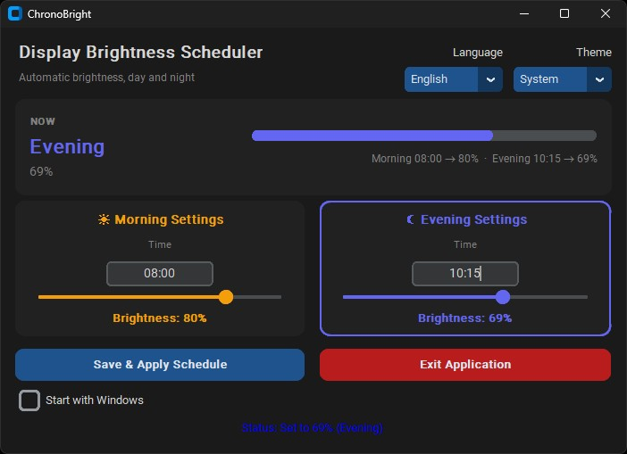

# ChronoBright

ChronoBright is a lightweight Windows desktop application that automatically
adjusts your display brightness on a schedule. Set a morning level and an
evening level, each with its own time, and ChronoBright handles the rest in
the background from the system tray.



## Features

- **Scheduled brightness** — separate morning/evening times and levels, applied
  automatically with DST-safe period tracking.
- **Live status card** — current period, brightness bar and schedule summary at
  a glance; the active settings card is highlighted.
- **System tray** — closing the window hides it to the tray; tooltip shows the
  active period. Brightness is restored on exit.
- **English and Turkish UI** with System/Light/Dark theme selector, both
  persisted across restarts.
- **Start with Windows** toggle (registry Run key) plus `--minimized` flag.
- **Safety guards** — single-instance lock, 10% minimum brightness (no black
  screens, legacy values are clamped), per-display best-effort restore.
- **Adaptive scheduler** — sleeps until the next transition instead of polling
  every second; transient display errors never kill the schedule.

## Requirements

- Windows 10 or 11
- Python 3.11 or later (only for running from source)
- A display that supports software brightness control (most laptop screens;
  some external monitors via DDC/CI)

No Python needed if you grab `ChronoBright.exe` from the
[releases](https://github.com/ulaskizilay/chrono-bright/releases) page.

## Installation

Clone the repository and install the dependencies:

```bash
git clone https://github.com/ulaskizilay/chrono-bright.git
cd chrono-bright
pip install -r requirements.txt
```

To install as a local package so you can run it with the `chronobright` command:

```bash
pip install -e .
```

## Running

If installed as a package:

```bash
chronobright
```

Or as a module from the repository root:

```bash
python -m chronobright
```

Available flags:

```bash
chronobright --minimized            # start hidden in the system tray
chronobright --enable-autostart     # launch at Windows login, then exit
chronobright --disable-autostart    # remove the login entry, then exit
chronobright --version
```

The console-free entry point `chronobright-gui` (no terminal window) is used
by the packaged `ChronoBright.exe`.

## How It Works

On startup, ChronoBright reads the saved configuration (if any), applies the
saved theme, immediately applies whichever period — morning or evening — is
currently active, and starts a background daemon thread. The thread detects
**period transitions** (morning ↔ evening) rather than firing one-shot
wall-clock jobs, so daylight-saving changes cause no duplicate or skipped
updates. It sleeps adaptively until the next boundary (capped at 60 seconds so
manual clock changes are picked up) and wakes early when the schedule changes.

Background threads never touch the UI directly: brightness callbacks enqueue
work that the Tk main loop drains, so the interface stays responsive and
crash-free.

Time inputs accept flexible formats (`8:0`, `9:5`) and are normalised to
`HH:MM` before validation and storage.

> **Multi-display note:** when a scheduled period applies, all detected
> displays are set to the same level. On exit, each display is restored to its
> own startup brightness level (best-effort, per display). Per-display
> schedules are not yet exposed in the UI; the underlying
> `BrightnessService.set_brightness(level, display=...)` API supports it for
> future use.

Closing the window sends the application to the system tray rather than
quitting. A second instance refuses to start while one is running.

## Configuration

User settings are stored at:

```
%APPDATA%\ChronoBright\config.json
```

Example:

```json
{
  "morning_time": "08:00",
  "morning_brightness": 80,
  "evening_time": "19:00",
  "evening_brightness": 69,
  "language": "en",
  "appearance": "Dark"
}
```

The file is plain JSON and is written atomically every time settings change
(write to a temporary file, then replace). You can edit it by hand — the
application validates it on load, keeps a `.corrupt.bak` copy of invalid
files, and falls back to defaults without losing your language/theme choice.
Values below 10% are clamped up to the 10% minimum on load.

## Logs

Application logs are written to:

```
%APPDATA%\ChronoBright\logs\chronobright.log
```

Log output also appears in the console when the application is started from a
terminal.

## Project Structure

```
chrono-bright/
├── assets/                        # Screenshots used by this README
├── packaging/
│   └── chronobright.spec          # PyInstaller spec for ChronoBright.exe
├── chronobright/
│   ├── __init__.py                # Package version (from installed metadata)
│   ├── __main__.py                # Entry point (`python -m chronobright`, CLI flags)
│   ├── config.py                  # Constants, paths, validators, appearance modes
│   ├── i18n.py                    # English/Turkish translations
│   ├── logger.py                  # Centralised logging (lazy init)
│   ├── models.py                  # Validated schedule data model
│   ├── single_instance.py         # Lock file preventing double runs
│   ├── time_utils.py              # Time normalisation, period and sleep math
│   ├── services/
│   │   ├── autostart_service.py   # Windows login entry (Run key)
│   │   ├── brightness_service.py  # Read/write display brightness
│   │   ├── schedule_service.py    # Adaptive background scheduler
│   │   ├── settings_service.py    # Atomic JSON config persistence
│   │   └── tray_service.py        # System tray icon, menu and tooltip
│   └── ui/
│       ├── app.py                 # Main window, hero card, UI queue
│       └── theme.py               # CustomTkinter theme setup
├── tests/                         # Unit tests (mocked GUI, no display needed)
├── .github/workflows/
│   ├── ci.yml                     # Ruff, mypy, pytest with coverage on Windows
│   └── release.yml                # Release assets incl. ChronoBright.exe
├── pyproject.toml                 # Package metadata and tool config
├── requirements.txt               # Pinned production dependencies
└── requirements-dev.txt           # Development tools (ruff, mypy, pytest)
```

## Development

Install development dependencies:

```bash
pip install -r requirements-dev.txt
```

Lint and type-check:

```bash
ruff check .
mypy chronobright
```

Run tests:

```bash
pytest
```

Run tests with coverage (85% threshold, also enforced in CI on Windows):

```bash
pytest --cov=chronobright --cov-report=term-missing --cov-fail-under=85
```

Pull requests and pushes to `main` trigger the GitHub Actions CI workflow
(Windows runner: ruff, mypy, pytest with coverage). Tag pushes matching `v*`
build release artifacts — wheel, sdist and `ChronoBright.exe` — via
`release.yml`. The exe is built with:

```bash
pip install pyinstaller
pyinstaller packaging/chronobright.spec
```

## License

MIT
